# Anmerkungen

Diese Dokumentation beschreibt hauptsächlich die im Rahmen des Projektes neu eingefügten Änderungen.
Die Änderungen zur zweiten und fünften Hausübung, welche Vorarbeiten für das Projekt beinhalten sind explizit angeführt.

# Funktionale Anforderungen

Im Rahmen der Projektarbeit wird das Nachtzugbuchungssystem aus der zweiten und fünften Übung erweitert.
Die Anwendung soll es grundsätzlich ermöglichen Nachtzugverbindungen zwischen zwei Destinationen anzuzeigen und für diese auch Tickets "buchen" zu können. Darüber hinaus wird ein "Entdeckungsmodus" angeboten, mit dem für einen Abfahrtsbahnhof alle Ziele angezeigt werden und entsprechende Tickets gebucht werden können.
Der Benutzer eines Tickets wird mittels E-Mail-Benachrichtigungen über den Status seiner Buchung (reserviert, bestätigt oder abgelehnt) auf dem Laufenden gehalten.

# Architektur

## System

Das Diagramm unten zeigt die Architektur des Systems.
Die Services für das Suchen von Verbindungen zwischen Bahnhöfen (Timetable-Service), für das Buchen von Tickets (Booking-Service), das API-Gateway, welches Clients einen einheitlichen Endpunkt bietet und an das Booking-Service sowie das Timetable-Service delegiert, sowie das Notification-Service werden dabei einem Kubernetes-Cluster betrieben, wobei Minikube als Kubernetes-Distribution verwendet wird.

Das Timetable- und das Booking-Service stellen dabei jeweils eine REST-Schnittstelle zur Verfügung und eine entsprechende Dokumentation mittels OpenAPI zur Verfügung.
Das API-Gateway vereinheitlicht den Zugriff auf die beiden REST-Schnittstellen und stellt ebenfalls eine OpenAPI-Dokumentation bereit, welche aus den beiden OpenAPI-Dokumentationen der Timetable- und Booking-Services automatisch zusammengestellt wird.
Das Booking-Service publisht zusätzlich Buchungen, deren Status (reserviert, bestätigt oder abgelehnt) sich ändert, an eine entsprechende AMQP-Queue.
Der Notification-Service tritt als entsprechender Subscriber ein und erstellt bei Empfang einer Nachricht eine entsprechende E-Mail und sendet diese an den Benutzer, der mit der Buchung assoziiert ist.

Darüber hinaus werden noch die benötigten Infrastruktur-Komponenten, nämlich die PostgreSQL-Datenbank, die Mongo-Datebank, der RabbitMQ-Server und der Jaeger-Server in Kubernetes betrieben.
Sowohl das API-Gateway, der Timetable-Service und der Booking-Service sind mit entsprechenden Tracern implementiert, über welche Aufrufe nachverfolgt werden und an den Jaeger-Service reportet werden können.

Das Booking-Service, das Timetable-Service und das API-Gateway sollen ihre Konfiguration aus Kubernetes-ConfigMaps und -Secrets beziehen.

Die Authentifizierung erfolgt über OAuth und daher über JWTs.
Als Authentifizierungs-Provider wird – auf Anraten von Prof. Heinzelreiter – Okta verwendet.
Im Backend überprüfen sowohl API-Gateway und Booking-Service die JWTs beim Zugriff auf Ressourcen zur Buchung von Tickets.
Das API-Gateway leitet die JWTs an das Booking-Service weiter.

Das Web-Frontend ist mit React und TypeScript realisiert und bietet eine graphische Möglichkeit Verbindungen zu suchen sowie Tickets zu buchen.

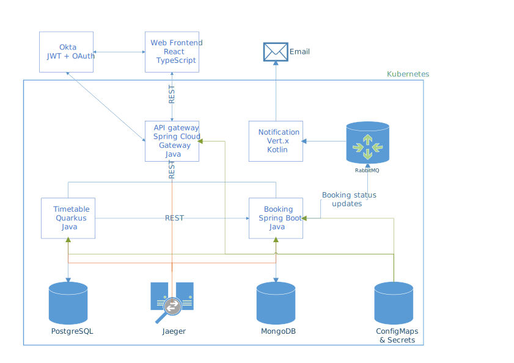

## Ablauf der Kommunikation zur Buchung eines Tickets

Das unten zu sehende Sequenzdiagramm zeigt den Ablauf zur Anzeige der Verbindungen sowie zur Buchung eines Tickets zwischen zwei Stationen.
Dabei dient das Gateway als zentrales Element in der Kommunikation zwischen Benutzer und dem Timetable- sowie dem Booking-Service.

Bei der Verarbeitung einer Buchungsanfrage lädt der Booking-Service zuerst die gesamte Route vom Timetable-Service und teilt diese in Einzelverbindungen nach Umstiegen auf.
Da bei einem Response für Verbindungen aus Datensparsamkeitsgründen die Verbindungen nicht mitgeschickt werden, muss für jede Umstiegsverbindung diese Information noch einmal vom Timetable-Service angefordert.

Basierend auf den Informationen über den Zug, der für den Hop eingesetzt wird und den bisherigen Buchungen für diesen Hop kann der Booking-Service bei genügend Platz entweder eine weitere Buchung generieren oder die Buchungsanfrage aufgrund von Überbuchung ablehnen.

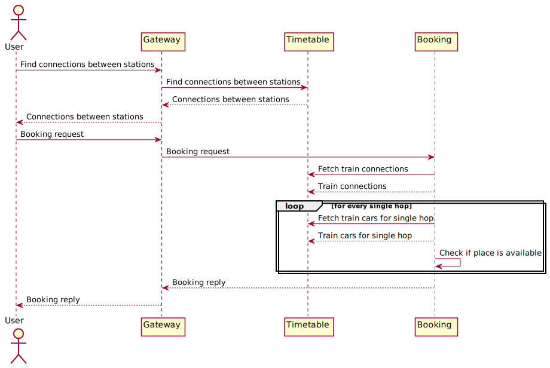

## Domänenmodelle

### Timetable-Service

Die folgende Abbildung zeigt ein UML-Klassendiagramm des Domänenmodells.
Die Klassen des Domänenmodells sind jeweils mit JPA-Annotationen angereichert und werden daraus folgend mittels JPA persistiert.

Die Klasse `RailwayStation` dient zur Abbildung von Bahnhöfen, welche über eine ID und einen Namen verfügen.
Die Klasse `TrainConnection` stellt eine Zugverbindung dar, welche über eine ID, einen Code zur Identifizierung durch Passagiere und Personal (z.B. NJ466) und eine Menge von Waggons verfügt.

Ein Waggon (Klasse `TrainCar`) hat ebenfalls eine ID, eine Nummer, die innerhalb des Zuges eindeutig ist (z.B. 21) und Passagieren hilft, den Waggon, in welchem sich ihr Platz befindet, zu finden, einen Typ, also ob es sich um einen Schlaf-, Liege- oder Sitzwagen handelt und die Kapazität des Waggons.
Eine Navigation von einem Waggon zu der Zugverbindung, auf welcher dieser eingesetzt wird, ist ebenfalls möglich.

Den Zusammenhang welche Bahnhöfe mittels welcher Zugverbindung erreicht werden können stellt die Klasse `RailwayStationConnection` dar.
Eine Ausprägung dieser Domänenklasse definiert einen Hop einer Verbindung.
Ein Hop verbindet jeweils zwei aufeinanderfolgende Bahnhöfe, z.B. Wien Hauptbahnhof nach Wien Meidling auf der Verbindung von Wien Hauptbahnhof nach Zürich Hauptbahnhof.
Die gesamte Verbindung von z.B. Wien Hauptbahnhof nach Zürich Hauptbahnhof wird als eine Sequenz von Objekten der Klasse `RailwayStationConnection` modelliert: Ausgehend von Wien Hauptbahnhof nach Wien Meidling gibt es pro Zwischenhalt ein Objekt der Klasse `RailwayStationConnection` bis der Ankunftsbahnhof Zürich Hauptbahnhof entspricht.
Der Zielbahnhof eines Hops ist daher der Abfahrtsbahnhof des darauf folgenden Hops.
So ist z.B. Wien Meidlung der Ankunftsbahnhof des Hops von Wien Hauptbahnhof nach Wien Meidling und gleichzeitig der Ausgangsbahnhof des Hops von Wien Meidling nach St. Pölten.
Alle Hops einer direkten Zugverbindung (z.B. von Wien Hauptbahnhof nach Zürich Hauptbahnhof) haben daher das gleiche Objekt vom Typ `TrainConnection` zugeordnet.
Ein Umsteigen (z.B. in Wien Hauptbahnhof auf der Verbindung von Rom nach Berlin Hauptbahnhof) wird durch einen Wechsel des Objekts vom Typ `TrainConnection` signalisiert, wie er eben im Hop mit Ankunftsbahnhof Wien Hauptbahnhof zum nächsten Hop mit Abfahrtsbahnhof Wien Hauptbahnhof stattfindet.

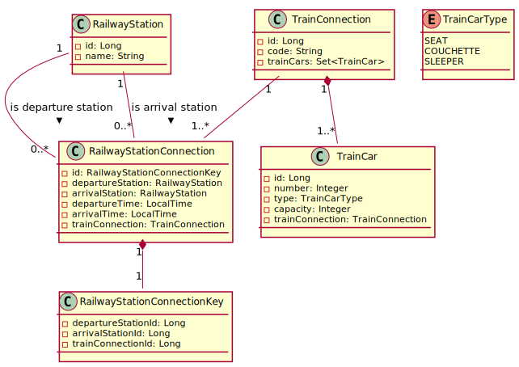

### Booking-Service

Die folgende Abbildung zeigt ein UML-Klassendiagramm des Domänenmodells. Die Klassen des Domänenmodells sind jeweils mit JPA-Annotationen angereichert und werden daraus folgend mittels JPA persistiert. 

Die Klasse `Booking` dient zur Abbildung von Buchungen, welche über eine ID, eine DepartureStationId (Id des Startbahnhofs), ArrivalStationId (Id des Zielbahnhofs), ein Abfahrdatum, einen Wagentyp (Schlaf-, Liege- oder Sitzwagen), die E-Mail-Adresse des Kunden, der die Buchung vorgenommen hat, einen Status (reserviert, bestätigt oder abgelehnt) und eine Menge an Tickets verfügt.
Dabei bezieht sich der Startbahnhof auf den Start und der Zielbahnhof auf das Ziel der Zugverbindung (eine Zugverbindung besteht aus mehreren Hops).

Die Klasse `Ticket` dient zur Abbildung von Tickets, also einen Hop auf der Strecke von Start- nach Zielbahnhof der Buchung, welche eine ID des Startbahnhofs, eine ID des Zielbahnhofs, die ID des Wagens für welchen die Reservierung gilt, die Platznummer innerhalb des Wagens, die ID der Zugverbindung und das Abfahrdatum der Zugverbindung verfügt.
Zusätzlich werden in der Menge mit dem Namen `departureStationIds` die IDs aller Abfahrtsbahnhöfe gespeichert, was die Überprüfung, ob der Zug auf einer Teilstrecke bereits voll ist, wesentlich erleichtert.

Das Domänenmodell wurde in der fünften Übung durch die Neuimplementierung des Booking-Services erleichtert und von der fünften Übung auf das Projekt wurde zusätzlich die E-Mail-Adresse, welche aus dem OAuth-Token extrahiert wird, in das Domänemodell aufgenommen.

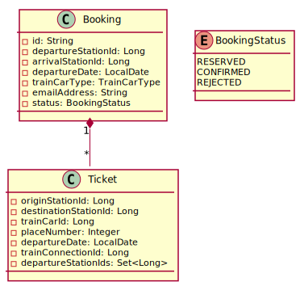

# Timetable-Service

Das Timetable-Service ist für das Abfragen von Bahnhöfen, Details zu Zügen, Verbindungen zwischen Bahnhöfen verantwortlich.
Die Implementierung entspricht immer noch weitgehend jener aus der zweiten Übung, wurde aber für den Einsatz in Kubernetes angepasst.

## Health-Checks

Die hauptsächlich notwendige Anpassung ist das Hinzufügen von Health-Checks, sodass Kubernetes eine Health- und Readiness-Probe durchführen kann.
Hierzu ist zu Beginn das entsprechende Dependency einzufügen:

```xml
<dependency>
    <groupId>io.quarkus</groupId>
    <artifactId>quarkus-smallrye-health</artifactId>
</dependency>
```

Laut [Quarkus-Guide](https://quarkus.io/guides/microprofile-health) werden standardmäßig die Routen für die Readiness- und Liveness-Probe von Kubernetes implementiert.
Für die Readiness-Probe wird darüber hinaus bei der Verwendung eines JDBC-Datenbanktreibers ein Standardtest implementiert, welcher überprüft, ob die Verbindung zur Datenbank hergestellt werden kann.
Da dies für den Timetable-Service ausreichend ist, muss keine zusätzliche Readiness-Probe implementiert werden.

Jedoch wird standardmäßig keine Liveness-Probe implementiert.
Hierzu empfiehlt es sich eine benuzterdefinierte Livness-Probe bereitzustellen, welche z.B. überprüft, ob eine Verbindung zwischen zwei Bahnhöfen gefunden werden kann.
Der Code für diese ist im folgenden Listing aufgeführt.
Durch Angabe der Annotationen `@ApplicationScoped` und `@Liveness` wird der Check automatisch im Health-Framework registriert.

```java
@ApplicationScoped
@Liveness
public class ConnectionLookupHealthCheck implements HealthCheck {
	private static final long RAILWAY_STATION_ID_VIENNA_CENTRAL_STATION = 0L;
	private static final long RAILWAY_STATION_ID_ZURICH_CENTRAL_STATION = 14L;

	private static final String HEALTH_CHECK_NAME = "Connection lookup health check";

	private final RouteManager routeManager;

	@Inject
	public ConnectionLookupHealthCheck(RouteManager routeManager) {
		this.routeManager = routeManager;
	}

	@Override
	public HealthCheckResponse call() {
		try {
			List<RailwayStationConnectionDto> connections = this.routeManager.findAllStopsBetween(
					RAILWAY_STATION_ID_VIENNA_CENTRAL_STATION,
					RAILWAY_STATION_ID_ZURICH_CENTRAL_STATION
			);
			if (connections.size() > 0) {
				return HealthCheckResponse.up(HEALTH_CHECK_NAME);
			}
		} catch (NoRouteException exception) {
			exception.printStackTrace();
		}
		return HealthCheckResponse.down(HEALTH_CHECK_NAME);
	}
}
```

### Tests

Nun kann z.B. mittels `curl` überprüft werden, ob das Service verfügbar ist, indem der Endpunkt `/health` abgefragt wird.
Wie in der unteren Ausgabe ersichtlich ist, setzt sich das Ergebnis des Gesundheitszustands der Anwendung aus den Ergebnissen der Checks zusammen.
Da sowohl der Check für die Liveness-Probe als auch für die Health-Probe den Zustand als gesund befunden haben, wird der Gesamtzustand ebenfalls als gesund befunden.

```bash
$ curl -X GET -i http://localhost:8082/health/

HTTP/1.1 200 OK
content-type: application/json; charset=UTF-8
content-length: 252


{
    "status": "UP",
    "checks": [
        {
            "name": "Connection lookup health check",
            "status": "UP"
        },
        {
            "name": "Database connections health check",
            "status": "UP"
        }
    ]
}
```

Die folgende Ausgabe zeigt noch das Ergebnis der Abfrage der Pfade für den Livness- und Health-Check an.
Diese werden auch für die Konfiguration in Kubernetes verwendet.

```bash
$ curl -X GET -i http://localhost:8082/health/live
HTTP/1.1 200 OK
content-type: application/json; charset=UTF-8
content-length: 147


{
    "status": "UP",
    "checks": [
        {
            "name": "Connection lookup health check",
            "status": "UP"
        }
    ]
}

$ curl -X GET -i http://localhost:8082/heath/ready
HTTP/1.1 200 OK
content-type: application/json; charset=UTF-8
content-length: 150


{
    "status": "UP",
    "checks": [
        {
            "name": "Database connections health check",
            "status": "UP"
        }
    ]
}
```

## Automatisierte Tests

Im Rahmen der zweiten Übung wurde eine Integrations-Test-Suite erstellt, welche überprüft, ob der Timetable-Service die Standardgeschäftsfälle erfolgreich behandelt.
Da die Version des Quarkus-Framework, mit welchem der Timetable-Service implementiert ist, bereits zweimal um eine Major-Release erhöht wurde, konnte mit der Test-Suite sichergestellt werden, dass es dadurch zu keinem Verlust der Funktionalität kam.
In der unteren Abbildung ist zu sehen, dass die Testfälle des timetable-Services erfolgreich ausgeführt werden.

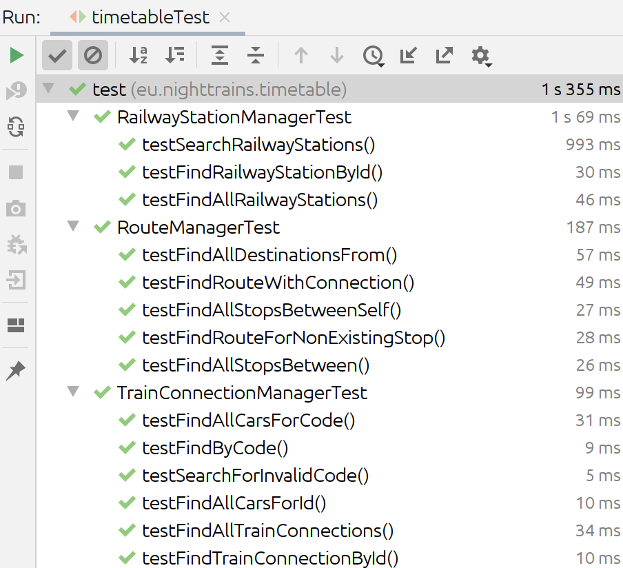

# Booking-Service

Das Booking-Service verwaltet Buchungen für Züge.
Dabei werden Buchungsanfragen entgegengenommen, die benötigten Informationen (Verbindung zwischen Abfahrts- und Ankunftsbahnhof sowie Wagons der Züge) vom Timetable-Service geladen und anschließend wird noch überprüft, ob die Buchung durchgeführt werden kann oder ob der Zug voll ist.

Der Service konnte ebenfalls weitgehend aus der fünften Übung übernommen werden inklusive der Eigenschaften für Polyglot-Persistence und Eventual-Consistency.
Im Zuge dieser Übung werden die Routen der Buchung mittels eines OAuth2-Mechanismus abgesichert
Zusätzlich wird jetzt noch die E-Mail-Adresse des Kunden zur Buchung gespeichert.
Über dies Information kann nun ebenfalls beim Laden der Buchung überprüft werden, ob die E-Mail-Adresse der Buchung mit jener aus dem OAuth-Token extrahierten E-Mail-Adresse übereinstimmt und bei Nichtübereinstimmung wird eine Exception ausgelöst.

## Authentifizierung

Für die Authentifizierung wird wieder Okta als OAuth2-Provider eingesetzt.
Dabei wird die Authentifizierung vom API-Gateway durchgeführt, was in Details später in diesem Protokoll beschrieben wird.

Um einen solchen Authentifizierungsflow zu ermöglichen, sind zuerst die benötigten Dependencies zum Projekt hinzuzufügen:

```xml
<dependency>
	<groupId>org.springframework.boot</groupId>
	<artifactId>spring-boot-starter-security</artifactId>
</dependency>
<dependency>
	<groupId>com.okta.spring</groupId>
	<artifactId>okta-spring-boot-starter</artifactId>
	<version>1.4.0</version>
</dependency>
```

Als Nächstes ist in der Konfiguration einzustellen, dass auf die Endpunkte zur Verwaltung der Buchung nur nach erfolgter Authentifizierung mittels OAuth zugegriffen werden darf, während auf alle anderen Endpunkte (z.B. OpenAPI-Dokumente) auch ohne Authentifizierung zugegriffen werden darf.
Erfolgt ein unauthorisierter Zugriff wird der HTTP-Status-Code 401 zurückgeliefert.
Der unten ersichtliche Quellcode zeigt die Einstellungen zur Erreichung des beschriebenen Verhaltens.

```java
@Configuration
public class WebSecurityConfiguration extends WebSecurityConfigurerAdapter {
    @Override
    protected void configure(HttpSecurity http) throws Exception {
        http.csrf().disable();
        http
                .authorizeRequests()
                        .antMatchers("/booking").authenticated()
                        .antMatchers("/booking/**").authenticated()
                        .anyRequest().permitAll()
                        .and()
                .oauth2ResourceServer().jwt();

        Okta.configureResourceServer401ResponseBody(http);
    }
}
```

Als Nächstes muss in der Konfiguration die Verbindung vom Booking-Service zu Okta hergestellt werden.
Hierzu müssen die unten zu sehenden Properties gesetzt werden.
Damit diese auch geheim bleiben, wird hierfür ein eigenes Spring-Boot-Profil definiert und die Konfigurationsdatei für dieses Profil nicht eingecheckt.

```properties
okta.oauth2.issuer = https://dev-649162.okta.com/oauth2/default
okta.oauth2.client-id = 0oaf4thceV73lVUCp4x6
okta.oauth2.client-secret = ...
```

Der Zugriff auf die E-Mail-Adresse von den REST-Endpunkten kann wie unten angegeben durchgeführt werden.
Die Authentifizierungsoptionen können über einen Parameter vom Typ `Principal` injiziert werden, welcher zusätzlich mit der Annotation `@AuthenticationPrincipal` dekoriert sein muss.
Dies ist im unten angegebenen Code-Snippet zu sehen.
Über diesen kann anschließend die E-Mail-Adresse (bei Okta als Name gesetzt) ermittelt werden.

```java
@GetMapping(value = "/booking/{id}")
public ResponseEntity<BookingDto> findById(
        @PathVariable("id") @NotBlank String id,
        @AuthenticationPrincipal Principal principal
) {
    try {
        BookingDto bookingDto = bookingService.findById(id, principal.getName());
        return new ResponseEntity<>(bookingDto, HttpStatus.OK);
    } catch (BookingNotFoundException exception) {
        return new ResponseEntity<>(HttpStatus.NOT_FOUND);
    } catch (UnauthorizedBookingAccess exception) {
        return new ResponseEntity<>(HttpStatus.FORBIDDEN);
    }
}
```

Der folgende Quellcode zeigt noch den Zugriff auf die E-Mail-Adresse vom POST-Endpunkt zum Buchen eines Tickets aus.

```java
@PostMapping(value = "/booking")
public ResponseEntity<BookingDto> book(
        @RequestBody @Valid BookingRequestDto bookingRequestDto,
        @AuthenticationPrincipal Principal principal
) {
    try {
        BookingDto bookingDto = bookingService.book(
                bookingRequestDto.getDepartureStationId(),
                bookingRequestDto.getArrivalStationId(),
                bookingRequestDto.getDepartureDate(),
                bookingRequestDto.getTrainCarType(),
                principal.getName()
        );
        return new ResponseEntity<>(bookingDto, HttpStatus.CREATED);
    } catch (NoConnectionsAvailableException exception) {
        return new ResponseEntity<>(HttpStatus.BAD_REQUEST);
    }
}
```

## Spring Cloud OpenFeign

Um die Kommunikation mit dem TimeTable-Service über dessen REST-Schnittstelle auf intuitive weise in die
Geschäftslogik des Booking-Services zu integrieren wurde OpenFeign verwendet. Es handelt sich hierbei um ein Framework, welches die REST-Operationen auf ein Java-Interface über Annotationen bindet.

```java
@FeignClient(name = "timeTableRestClientFeign", url = "${timetable.url}", primary = false)
@Profile("!test")
public interface TimeTableRestClientFeign {
    @RequestMapping(method = RequestMethod.GET, value = "/destinations/from/{originId}/to/{destinationId}")
    List<RailwayStationConnectionDto> getRailwayConnections(@PathVariable("originId") Long originId,
                                                            @PathVariable("destinationId") Long destinationId);

    @RequestMapping(method = RequestMethod.GET, value = "/trainConnection/{id}/cars")
    List<TrainCarDto> getTrainCarsForConnectionId(@PathVariable("id") Long id);

    @RequestMapping(method = RequestMethod.GET, value = "/trainConnection/code/{code}/cars")
    List<TrainCarDto> getTrainCarsForConnectionCode(@PathVariable("code") String code);
}
```
Wie der obige Ausschnitt aus `TimeTableRestClientFeign` zeigt, wird mit der `@FeignClient` Annotation der Ziel-URL aus der Spring-Konfigurationsdatei übergeben und die abzufragenden Endpunkte so definiert, wie sich auch im REST-Service definiert sind.
Mittels der `@RequestMapping` Annotation wird der Endpunkt-URL mit der dazugehörigen HTTP-Methode und den Parametern definiert.
Dieses Interface kann mittels Dependency-Injection nun verwendet werden und OpenFeign löst die Methodenaufrufe zu HTTP-Aufrufen im Hintergrund auf.

### Exception-Translation

Da es vorkommen kann, dass die Methode `getRailwayConnections(originId, destinationId)` den HTTP-Fehlercode 404 zurückliefert, muss dieser zur sauberen Übersetzung in eine businesslogikspezifische Excpetion `NoConnectionsAvailableException` noch angepasst werden.
Um dies zu realisieren, wird Springs AOP-Mechanismus verwendet und die Exceptions mit einem After-Throwing-Advice entsprechend übersetzt.
Die Behandlung mittels AOP wurde im Vergleich zur fünften Hausübung eingeführt und ersetzt die Wrapper-Klasse.

```java
@Aspect
@Component
public class TimeTableRestClientFeignAdvice {
	@AfterThrowing(pointcut = "execution(public * eu.nighttrains.booking.service.rest.TimeTableRestClientFeign.getRailwayConnections(..))", throwing = "exception")
	public void translateNotFoundExceptionRailwayConnectionLookup(FeignException.NotFound exception) throws Throwable {
		throw new NoConnectionsAvailableException();
	}
}
```

## Health-Checks

Die Health-Checks, welche für die Livness- und Readiness-Probe benötigt werden, können mittels Spring-Boot-Actuator bereitgestellt werden.
Hierzu muss zuerst Spring-Boot-Actuator als Dependency hinzugefügt werden:

```xml
<dependency>
	<groupId>org.springframework.boot</groupId>
	<artifactId>spring-boot-starter-actuator</artifactId>
</dependency>
```

[Ab Spring Boot Version 2.3.0 werden die Endpunkte für Kubernetes-Health-Probes automatisch implementiert](https://docs.spring.io/spring-boot/docs/2.3.0.RELEASE/reference/html/production-ready-features.html#production-ready-kubernetes-probes).
Dabei erkennt die Spring-Boot-Anwendung, ob sie in einer Kubernetes-Umgebung ausgeführt wird und stellt in diesem Fall Endpunkte für die Kubernetes-Probes bereit.

## Publishen von Buchungsstatusupdates mit AMQP

Um E-Mail-Benachrichtigungen über die Aktualisierung des Buchungsstatus versenden zu können, veröffentlicht der Booking-Service eine JSON-Repräsentation der Benachrichtigungen an eine AMQP-Direct-Exchange.
Über den definierten Routing-Key wird die Nachricht anschließend einer von drei Queues zugewiesen, wobei eine Queue für bestätigte Buchungen, eine Queue für reservierte Buchungen und eine Queue für abgelehnte Buchungen zuständig ist.

Um das Publishen von Nachrichten via AMQP 0-9-1/RabbitMQ zu ermöglichen, muss die entsprechende Abhängigkeit in die Maven-Konfigurationsdatei aufgenommen werden:

```xml
<dependency>
	<groupId>org.springframework.boot</groupId>
	<artifactId>spring-boot-starter-amqp</artifactId>
</dependency>
```

Um den Technologiecode des Sendens einer JSON-Nachricht über AMQP vom Geschäftslogikcode des Reservierens einer Buchung trennen zu können, wird definiert Schnittstelle `BookingNotificationPublisher` eine Methode zur Veröffentlichung einer Nachricht.

```java
public interface BookingNotificationPublisher {
	void publishBookingStatusUpdate(Booking booking);
}
```

Eine Implementierung dieser Schnittstelle veröffentlicht anschließend JSON-Repräsentierungen der Nachricht über AMQP.
Der Quellcode der Klasse `BookingNotificationPublisherRabbitMQ` ist unten angegeben.
Hierbei wird die Funktionalität der von Spring-Boot-AMQP bereitgestellten Komponente `RabbitTemplate` zum Publishen von Nachrichten verwendet.
Der Routing-Key, welcher aufgrund des Direct-Exchanges das Routings der Nachricht an die entsprechende Queue wesentlich bestimmt, wird aufgrund des Wertes der Statusenumeration der veröffentlichten Buchung ermittelt.
Zu beachten ist, dass für den JSON-Mapper in Modul zur Behandlung der Zeit- und Datumsdatentypen, die mit Java 8 eingeführt wurden, registriert wird.

```java
@Component
public class BookingNotificationPublisherRabbitMQ implements BookingNotificationPublisher {
	private final RabbitTemplate rabbitTemplate;

	private final String exchangeName;
	private final String routingKeyConfirmed;
	private final String routingKeyReserved;
	private final String routingKeyRejected;

	private final Jackson2JsonMessageConverter amqpMessageConverter;

	public BookingNotificationPublisherRabbitMQ(
			@Autowired RabbitTemplate rabbitTemplate,
			@Value("${bookingstatusupdates.exchange-name}") String exchangeName,
			@Value("${bookingstatusupdates.routingkey.confirmed}") String routingKeyConfirmed,
			@Value("${bookingstatusupdates.routingkey.reserved}") String routingKeyReserved,
			@Value("${bookingstatusupdates.routingkey.rejected}") String routingKeyRejected
	) {

		this.rabbitTemplate = rabbitTemplate;
		this.exchangeName = exchangeName;
		this.routingKeyConfirmed = routingKeyConfirmed;
		this.routingKeyReserved = routingKeyReserved;
		this.routingKeyRejected = routingKeyRejected;

		ObjectMapper jsonMapper = new ObjectMapper();
		jsonMapper.registerModule(new JavaTimeModule());
		this.amqpMessageConverter = new Jackson2JsonMessageConverter(jsonMapper);
	}

	@Override
	public void publishBookingStatusUpdate(Booking booking) {
		this.rabbitTemplate.convertAndSend(
				this.exchangeName,
				this.lookupRoutingKeyForStatus(booking.getStatus()),
				this.serializeBooking(booking)
		);
	}

	private Message serializeBooking(Booking booking) {
		return this.amqpMessageConverter.toMessage(
				booking,
				new MessageProperties()
		);
	}

	private String lookupRoutingKeyForStatus(BookingStatus status) {
		switch (status) {
			case CONFIRMED:
				return this.routingKeyConfirmed;
			case RESERVED:
				return this.routingKeyReserved;
			case REJECTED:
				return this.routingKeyRejected;
			default:
				throw new IllegalArgumentException("Could not lookup routing key for booking status " + status);
		}
	}
}
```

Anschließend kann eine Instanz von `BookingNotificationPublisher` in den Service `BookingServiceMongoDb` injiziert werden und zur Veröffentlichen von Buchungsstatusupdates über AMQP verwendet werden.

Damit dies wie gewünscht funktioniert, muss noch eine Konfiguration erstellt werden, welche die Exchanges, die Queues sowie die Bindings entsprechend konfiguriert.
In der unten zu sehenden Konfiguration wird der Exchange zur Veröffentlichung von Buchungsstatusupdates, die drei Queues für die jeweiligen Buchungsstatuskategorien und die entsprechenden Bindings der Exchange and die Queues mit dem gegebenen Routing-Key festgelegt.

```java
@Configuration
public class AmqpConfiguration {
	private final String exchangeName;
	private final String confirmationQueueName;
	private final String reservationQueueName;
	private final String rejectionQueueName;
	private final String routingKeyConfirmed;
	private final String routingKeyReserved;
	private final String routingKeyRejected;

	public AmqpConfiguration(
			@Value("${bookingstatusupdates.exchange-name}") String exchangeName,
			@Value("${bookingstatusupdates.queue.confirmation}") String confirmationQueueName,
			@Value("${bookingstatusupdates.queue.reservation}") String reservationQueueName,
			@Value("${bookingstatusupdates.queue.rejection}") String rejectionQueueName,
			@Value("${bookingstatusupdates.routingkey.confirmed}") String routingKeyConfirmed,
			@Value("${bookingstatusupdates.routingkey.reserved}") String routingKeyReserved,
			@Value("${bookingstatusupdates.routingkey.rejected}") String routingKeyRejected
	) {
		this.exchangeName = exchangeName;
		this.confirmationQueueName = confirmationQueueName;
		this.reservationQueueName = reservationQueueName;
		this.rejectionQueueName = rejectionQueueName;
		this.routingKeyConfirmed = routingKeyConfirmed;
		this.routingKeyReserved = routingKeyReserved;
		this.routingKeyRejected = routingKeyRejected;
	}

	@Bean
	public Queue confirmationQueue() {
		return new Queue(this.confirmationQueueName, true, false, false);
	}

	@Bean
	public Queue reservationQueue() {
		return new Queue(this.reservationQueueName, true, false, false);
	}

	@Bean
	public Queue rejectionQueue() {
		return new Queue(this.rejectionQueueName, true, false, false);
	}

	@Bean
	public DirectExchange exchange() {
		return new DirectExchange(this.exchangeName, true, false);
	}

	@Bean
	public Binding bindingConfirmation(Queue confirmationQueue, DirectExchange exchange) {
		return BindingBuilder.bind(confirmationQueue).to(exchange).with(this.routingKeyConfirmed);
	}

	@Bean
	public Binding bindingReservation(Queue reservationQueue, DirectExchange exchange) {
		return BindingBuilder.bind(reservationQueue).to(exchange).with(this.routingKeyReserved);
	}

	@Bean
	public Binding bindingRejection(Queue rejectionQueue, DirectExchange exchange) {
		return BindingBuilder.bind(rejectionQueue).to(exchange).with(this.routingKeyRejected);
	}
}
```

Die Namen der Exchange, der Queues und der Routing-Keys sind in der allgemeinen Konfigurationsdatei festgelegt, wie im folgenden Quellcodeauszug zu sehen ist.

```properties
bookingstatusupdates.exchange-name = bookingstatusupdatesexchange
bookingstatusupdates.queue.confirmation = bookingstatusupdatesqueue.confirmed
bookingstatusupdates.queue.reservation = bookingstatusupdatesqueue.reserved
bookingstatusupdates.queue.rejection = bookingstatusupdatesqueue.rejected
bookingstatusupdates.routingkey.confirmed = bookingstatusupdates.confirmed
bookingstatusupdates.routingkey.reserved = bookingstatusupdates.reserved
bookingstatusupdates.routingkey.rejected = bookingstatusupdates.rejected
```

Für das Profil zum Betrieb der Anwendung in Kubernetes muss der AMQP-Host noch entsprechend auf den Namen des Services geändert werden, wie im folgenden Auszug aus dem Kubernetes-Konfigurationsprofil zu sehen ist.

```properties
spring.rabbitmq.host=rabbitmq-service
spring.rabbitmq.port=5672
```

## Automatisierte Tests

Die aus der fünften Übung bekannte automatisierte Test-Suite, welche Unit-Tests für die Komponente zur Berechnung der Dauer einer Reise, Tests für die MongoDB-Zugriffsschicht sowie Integrationstests für das Service umfasst wurde im Zuge des Projektes ebenfalls erweitert.
So wird die Methode zum Laden einer Buchung ebenfalls getestet, ob korrekterweise eine Exception ausgelöst wird, wenn die E-Mail-Adresse des Benutzers nicht mit jener für die Buchung vermerkten E-Mail-Adresse übereinstimmt.
Dieses Verhalten wird durch den folgenden Testfall `testBookingAuthorization` sichergestellt.

```java
@SpringBootTest
@Import(CircuitBreakerTestConfig.class)
class BookingServiceTest {
	// ...

	@Test
	void testBookingAuthorization() {
		assertDoesNotThrow(() -> {
			final BookingDto booking = this.bookingService.book(0, 14, LocalDate.of(2020, 6, 13), TrainCarType.SLEEPER, IntegrationTestConstants.EMAIL_ADDRESS);
			final BookingDto lookedUpBooking = this.bookingService.findById(booking.getId(), IntegrationTestConstants.EMAIL_ADDRESS);
			assertEquals(booking.getEmailAddress(), lookedUpBooking.getEmailAddress());
			assertThrows(UnauthorizedBookingAccess.class, () -> {
				this.bookingService.findById(booking.getId(), "homer.simpson@burnspowerplant.com");
			});
		});
	}

	// ...
}
```

Weiterhin wurden alle Testfälle aus der fünften Übung so angepasst, dass beim Erstellen einer Buchung die E-Mail-Adresse nun als Parameter mitgegeben wird.
Hierfür wird für die Tests der funktionalen Anforderungen einfach eine Standard-E-Mail-Adresse verwendet.

Der Zugriff auf die MongoDB wird weiterhin mittels einer eingebetteten In-Memory-Datenbank realisiert, was die Tests unabhängig von einer konkret laufenden MongoDB-Instanz macht.
Ebenso wird der Zugriff auf den Timetable mit dem im Zuge der fünften Übung entwickelten Mechanismus zum Mocking der Responses durch vorgerfertigte JSON-Dokumente vorgetäuscht.
Ebenso wird die Abhängigkeit an RabbitMQ mittels eines Mocks gelöst.
Hierfür wird ein entsprechender [Mock-Provider](https://github.com/fridujo/rabbitmq-mock) als Abhängigkeit hinzugefügt:

```xml
<dependency>
	<groupId>com.github.fridujo</groupId>
	<artifactId>rabbitmq-mock</artifactId>
	<version>1.1.0</version>
	<scope>test</scope>
</dependency>
```

Anschließend muss eine entsprechende Konfiguration für Testfälle erstellt werden, welche die RabbitMQ-Connection-Factory durch die Mock-Implementierung ersetzt.
Die entsprechende Klasse ist im unteren Code-Listing angegeben.

```java
import com.github.fridujo.rabbitmq.mock.MockConnectionFactory;
import org.springframework.amqp.rabbit.connection.CachingConnectionFactory;
import org.springframework.amqp.rabbit.connection.ConnectionFactory;
import org.springframework.boot.test.context.TestConfiguration;
import org.springframework.context.annotation.Bean;

@TestConfiguration
public class RabbitMqMockConfig {
	@Bean
	public ConnectionFactory connectionFactory() {
		return new CachingConnectionFactory(new MockConnectionFactory());
	}
}
```

Abschließend muss die Konfiguration noch als zusätzliche Konfiguration für alle Testklassen, die Funktionen zum Zugriff auf RabbitMQ bieten, hinzugefügt werden.
Dies ist exemplarisch im folgenden Snippet für die Klasse `BookingServiceTest` angegeben.

```java
@SpringBootTest
@Import({CircuitBreakerTestConfig.class, RabbitMqMockConfig.class})
class BookingServiceTest {
	// ...
}
```

Wie die folgende Abbildung zeigt, laufen alle Integrationstests erfolgreich durch.
Daher kann davon ausgegangen werden, dass die im Zuge der fünften Übung implementierte Funktionalität weiterhin wie gewünscht zur Verfügung steht.

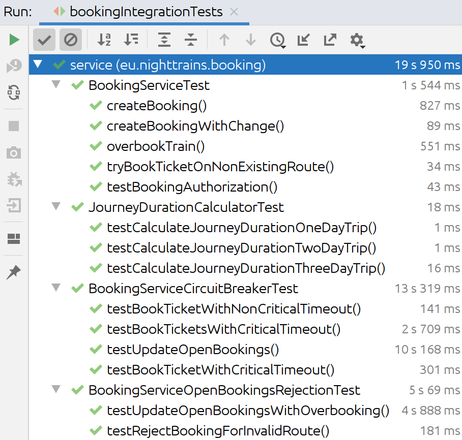

Ebenso werden die Tests des Data-Access-Layers erfolgreich durchgeführt, wie die untere Abbildung zeigt.

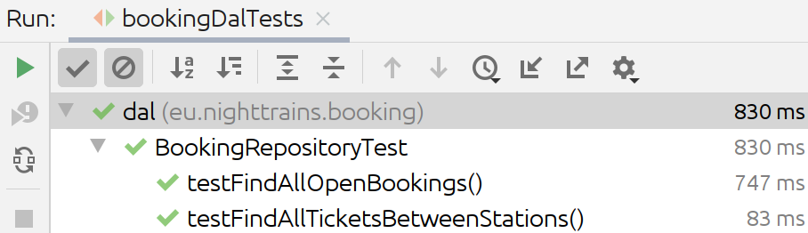

Besonderes Augenmerk gilt es auf die Tests zum Zugriff auf den Timetable-Service zu legen.
Diese mocken den Timetable-Service nicht, sondern testen, ob der mit OpenFeign generierte REST-Client erfolgreich auf den Service zugreifen kann.
Der Feign-Service verwendet nun zur Exception-Translation einen AOP-Mechanismus an Stelle des Wrappers.
Da die Tests nicht verändert wurden, die unten zu sehende Abbildung aber zeigt, dass auch die automatisierten Tests, welche einen Test für die Exception-Translation umfassen, ohne Fehler durchlaufen, kann davon ausgegangen werden, dass die Exception-Translation funktioniert.

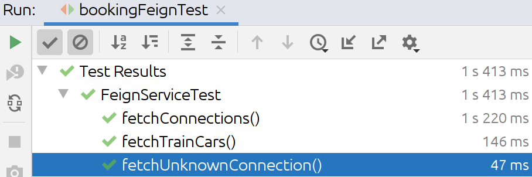

# API-Gateway

Das API-Gateway bietet einen zentralen Punkt, mit dem Clients auf das Timetable- und das Booking-Service zugreifen können.
Das API-Gateway ist mit Spring Cloud Gateway realisiert und in Java programmiert.
Zusätzlich übernimmt das API-Gateway noch die Authentifizierung und leitet die OAuth-Tokens an die Services weiter.

## Gateway-Funktionalität

Das Forwarding wird in einer YAML-Konfigurationsdatei für das Gateway eingestellt.
Dies bietet den großen Vorteil, dass über Spring-Boot-Profiles die für den Betrieb des Gateways in einem gewissen Modus (Entwicklung, Kubernetes-Cluster) je eine maßgeschneiderte Konfigurationsdatei bereit gestellt werden kann.

Die Konfigurationsdatei für den Betrieb im Entwicklungsmodus ist im folgenden Listing zu sehen.
Interessant ist hierbei die Sektion für das Spring-Cloud-Gateway.
In dieser werden drei Routen erstellt, wobei die erste Route für das Timetable-Service dient.
Hier wird mittels eines Pfad-Prädikates festgelegt, dass alle Anfragen, deren Pfad mit `/timetable/` beginnt an den Timetable-Service, welcher unter der URL `http://localhost:8082/` erreichbar ist, weitergeleitet werden.
Zusätzlich wird über Filter festgelegt, dass die URL so verändert wird, sodass der erste Teil des Pfades zwischen den ersten beiden Slashes, welcher für das Timetable-Service immer `/timetable/` lautet entfernt wird.
Dies ist notwendig, da ansonsten die volle URL, welche mit `/timetable/` beginnt, an den Timetable-Service geschickt werden würde, dieser aber das Pfad-Präfix `/timetable/` nicht kennt und daher einen HTTP-Status-Code 404 zurückliefern würde.
Der zweite Filter aktiviert noch einen Circuit-Breaker zum Zugriff auf die Methoden des Timetable-Services.
Dies kann in Spring Cloud Gateway komfortable durch hinzufügen der Dependency `spring-cloud-starter-circuitbreaker-reactor-resilience4j` realisiert werden.

Die Route für den Booking-Service ist prinzipiell gleich wie für den Timetable-Service realisiert.
Da die Zugriffe auf den Booking-Service jedoch eine Authentifizierung verlangen, wird noch ein Token-Relay-Filter hinzugefügt, welcher das OAuth-Token, welches das API-Gateway vom Client erhält, an den Booking-Service weiterleitet.
Dadurch kann der Booking-Service ebenfalls die Berechtigungen überprüfen.

Die dritte Regel wird benötigt, damit die Zugriffe auf die OpenAPI-Dokumente vom API-Gateway an die entsprechenden Services weitergeleitet werden.
Die Funktionalität mit den OpenAPI-Gruppen wird im nächsten Abschnitt genauer beschrieben.
Für jede Gruppe wird das OpenAPI-Dokument vom entsprechenden Service geladen.
Da Swagger-UI jedoch auf die Routen `/v3/api-docs/timetable` respektive `/v3/api-docs/booking` zugreift, welche standardmäßig vom OpenAPI-Gateway behandelt werden, muss eine Regel eingefügt werden, die z.B. `/v3/api-docs/timetable` auf dessen OpenAPI-Pfad `/timetable/v3/api-docs/` abbildet.
Anschließend greift die erste Regel und mappt den Zugriff auf die benötigte Ressource des Timetable-Services.
Das selbe Prinzip wird ebenfalls für den Booking-Service angewandt.

```yaml
spring:
  cloud:
    gateway:
      routes:
      - id: timetable
        uri: http://localhost:8082/
        predicates:
        - Path=/timetable/**
        filters:
        - StripPrefix=1
        - CircuitBreaker=timetableCircuitBreaker
      - id: booking
        uri: http://localhost:8084/
        predicates:
        - Path=/booking/**
        filters:
        - StripPrefix=1
        - CircuitBreaker=bookingCircuitBreaker
        - TokenRelay=
      - id: openAPI
        uri: http://localhost:${server.port}/
        predicates:
        - Path=/v3/api-docs/**
        filters:
        - RewritePath=/v3/api-docs/(?<path>.*), /$\{path}/v3/api-docs/
``` 

## OpenAPI

Das API-Gateway stellt eine gemeinsame OpenAPI-Dokumentation zur Verfügung, welche sich aus jener des Booking-Services und des Timetable-Services zusammensetzt.
Um die Dokumente nicht duplizieren zu müssen und somit Redundanz zu erzeugen, wird die Gruppierungsfunktionalität von OpenAPI verwendet.
Für jedes Service wird eine entsprechende Gruppe erzeugt, welche auf das OpenAPI-Dokument des Services verweist.
Der OpenAPI-Client (z.B. Swagger UI) kann anschließend die benötigte Gruppe für das Service auswählen und sich die entsprechende Dokumentation generieren lassen.
Dies wird in den nächsten beiden Screenshots verdeutlicht, wobei das Dropdown-Menü zur Auswahl der Gruppe hervorgehoben ist.
Im ersten Screenshot ist die Ansicht der OpenAPI-Gruppe für das Timetable-Service ersichtlich, während im zweiten die Ansicht der OpenAPI-Gruppe für das Booking-Service gezeigt wird.

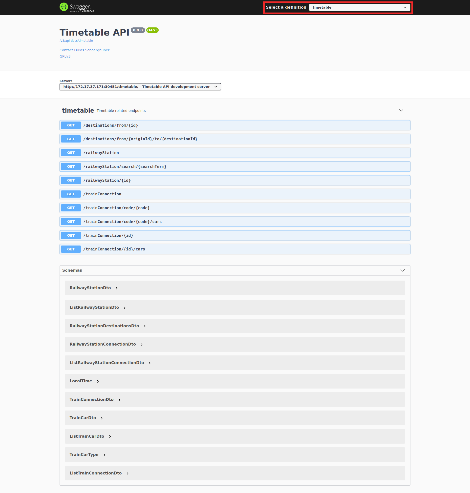
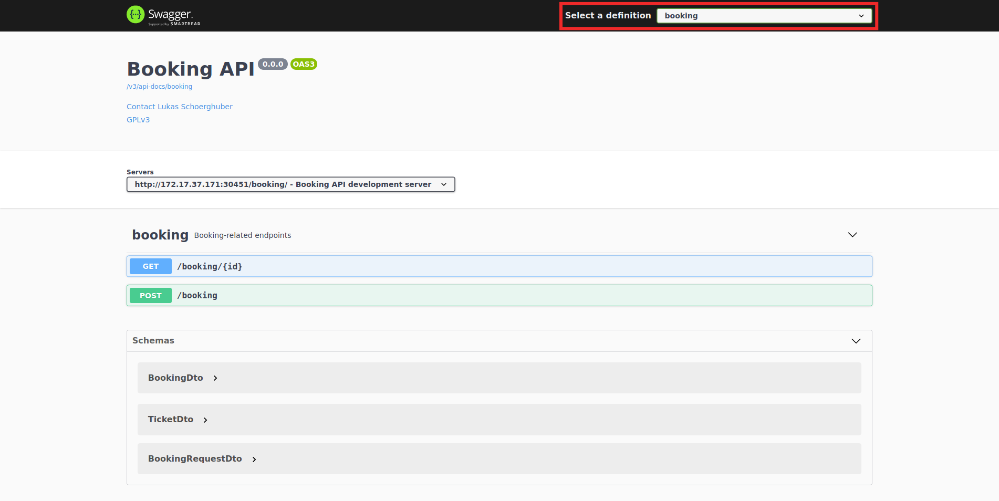

Um dies am API-Gateway zu realisieren, werden die unten gezeigten Dependencies benötigt.

```xml
<dependency>
	<groupId>org.springdoc</groupId>
	<artifactId>springdoc-openapi-webflux-core</artifactId>
	<version>${springdoc.version}</version>
</dependency>
<dependency>
	<groupId>org.springdoc</groupId>
	<artifactId>springdoc-openapi-webflux-ui</artifactId>
	<version>${springdoc.version}</version>
</dependency>
```

Anschließend müssen aus den Routendefinitionen noch die OpenAPI-Gruppen gewonnen werden.
Der unten zu sehende Code definiert ein Bean `apis`, welches die OpenAPI-Gruppen definiert.
Dabei werden die Definitionen für den Booking und den Timetable-Service geladen und aus diesen OpenAPI-Gruppen-Einträge erzeugt.

```java
@Configuration
public class OpenApiConfiguration {
	@Bean
	public List<GroupedOpenApi> apis(SwaggerUiConfigProperties swaggerUiConfigProperties, RouteDefinitionLocator routeDefinitionLocator) {
		List<GroupedOpenApi> groups = new ArrayList<>();
		List<RouteDefinition> definitions = routeDefinitionLocator
				.getRouteDefinitions()
				.collectList()
				.block();
		definitions.stream()
				.filter(routeDefinition ->
						routeDefinition.getId().equals("booking")
						|| routeDefinition.getId().equals("timetable")
				)
				.forEach(routeDefinition -> {
					swaggerUiConfigProperties.addGroup(routeDefinition.getId());
					groups.add(GroupedOpenApi.builder()
						.pathsToMatch("/" + routeDefinition.getId() + "/**")
						.group(routeDefinition.getId())
						.build()
					);
				});
		return groups;
	}
}
```

Abschließend müssen die Server-URLs in der Beschreibung des Timetable- und des Booking-Services noch so angepasst werden, dass diese auf die unter dem API-Gateway erreichbare URL des Services verweisen.
Dies wird in den folgenden zwei Quellcodeauszügen gezeigt.

```java
@OpenAPIDefinition(
        // ...
        servers = @Server(url = "http://172.17.37.171:30451/timetable/", description = "Timetable API development server"),
        // ...
)
// ...
public class TimetableApiApplication extends Application {
    public static final String OPEN_API_TAG_NAME_TIMETABLE = "timetable";
}
```

```java
// ...
@OpenAPIDefinition(
        // ...
        servers = @Server(url = "http://172.17.37.171:30451/booking/", description = "Booking API development server"),
        // ...
)
public class BookingApplication {
    public static void main(String[] args) {
        SpringApplication.run(BookingApplication.class, args);
    }
}
```

## Authentifizierung

Das API-Gateway überprüft den OAuth-Token und leitet diesen an die entsprechenden Services, welche ebenfalls die Authentifizierung überprüfen, in diesem Projekt das Booking-Service, weiter.
Um dies zu realisieren, sind die folgenden Dependencies einzubinden:

```xml
<dependency>
	<groupId>org.springframework.boot</groupId>
	<artifactId>spring-boot-starter-security</artifactId>
</dependency>
<dependency>
	<groupId>org.springframework.boot</groupId>
	<artifactId>spring-boot-starter-oauth2-client</artifactId>
</dependency>
<dependency>
	<groupId>com.okta.spring</groupId>
	<artifactId>okta-spring-boot-starter</artifactId>
	<version>1.4.0</version>
</dependency>
<dependency>
	<groupId>org.springframework.cloud</groupId>
	<artifactId>spring-cloud-starter-oauth2</artifactId>
</dependency>
<dependency>
	<groupId>org.springframework.cloud</groupId>
	<artifactId>spring-cloud-starter-security</artifactId>
</dependency>
```

In der Konfiguration für das Forwarding zu den Services wurde bereits die Token-Weiterleitung für das Booking-Service über einen Filter realisiert.
Anschließend muss noch eine Spring-Security-Konfiguration so definiert werden, dass die Authentifizierung über OAuth2 durchgeführt wird und für Zugriffe auf das Booking-Service benötigt wird.

```java
@EnableWebFluxSecurity
@EnableReactiveMethodSecurity
public class WebSecurityConfig {
	@Bean
	public SecurityWebFilterChain securityWebFilterChain(ServerHttpSecurity http) {
		http.csrf().disable();

		http
				.authorizeExchange()
						.pathMatchers(HttpMethod.POST, "/booking/booking/**").authenticated()
						.and()
				.authorizeExchange()
						.pathMatchers(HttpMethod.GET, "/booking/booking/**").authenticated()
						.and()
				.authorizeExchange()
						.anyExchange().permitAll()
						.and()
				.oauth2Login()
						.and()
				.oauth2ResourceServer()
						.jwt();
		return http.build();
	}
}
```


Wie in dem Kapitel zum Web-Frontend beschrieben, hatten wir Probleme mit der React-Integration von Okta und mussten daher auf den folgenden Ansatz ausweichen:
Das Gateway verwendet eine Web-Anwendungs-Konfiguration von Okta und leitet bei fehlender Authentifizierung auf die Login-Seite von Okta weiter.
Anschließend wird der OAuth-Token in der HTTP-Session am Gateway gespeichert und zur Authentifzierung herangezogen.
Dies erklärt den Aufruf von `.oauth2Login()` zur Aktivierung des OAuth2-Logins.

Die Okta-Konfiguration ist im folgenden Screenshot zu sehen.
Hierbei wird das Template für eine Webanwendung verwendet und die URLs werden entsprechend den [Beispielen aus dem Okta-Blog](https://developer.okta.com/blog/2019/08/28/reactive-microservices-spring-cloud-gateway) gesetzt.

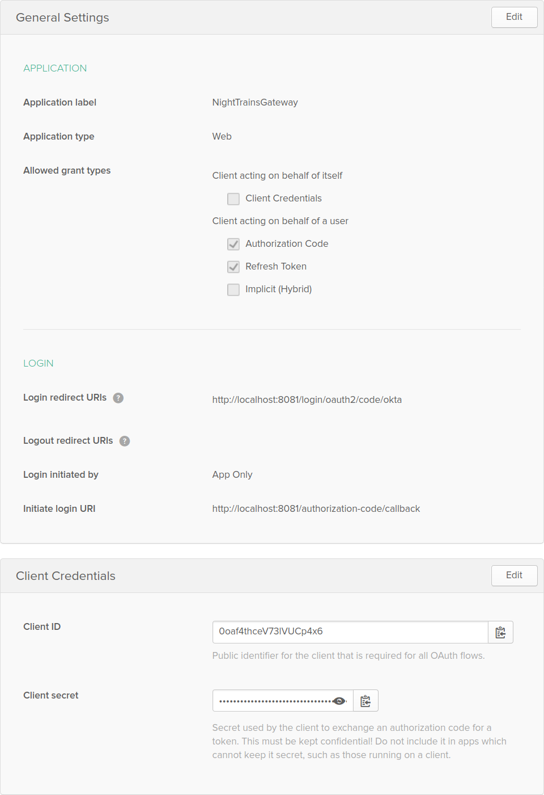

Da sich beim Betrieb im Kubernetes-Cluster die URLs unterscheiden, muss für den Betrieb im Kubernetes-Cluster eine zweite, äquivalente Dokumentation erstellt werden.

Ebenfalls müssen die Credentials des Okta-Zugangs am Gateway-Service in einer Konfigurationsdatei hinterlegt werden.
Der folgende Quellcodeauszug zeigt die benötigten Einstellungen zur Verknüpfung der Spring-Boot-Applikation mit der Okta-Konfiguration.
Um die Sicherheit der Credentials zu gewährleisten, wird die Konfigurationsdatei über ein eigenes Profil namens *security* geladen und **nicht** in das Git-Repository eingecheckt.

```properties
okta.oauth2.issuer = https://dev-649162.okta.com/oauth2/default
okta.oauth2.client-id = 0oaf4thceV73lVUCp4x6
okta.oauth2.client-secret = ...
```

Für den Betrieb im Kubernetes-Cluster wurde noch eine eigene Konfigurationsdatei und ein eigenes Profil erstellt.

### CORS

Natürlich muss für das API-Gateway ebenfalls eine CORS-Konfiguration vorgenommen werden.
Da der Client Cookies bei einem einem CORS-Request mitsenden muss, müssen die erlaubten Origins explizit festgelegt werden sowie die Option zur Erlaubnis von Credentials aktiviert werden.
Dies und die andere standardmäßige Konfiguration wird in dem folgenden Quellcodeauszug gezeigt.

```java
@Configuration
public class WebCorsConfiguration {
	@Value("${cors.origins.webFrontend}")
	private String corsOriginWebFrontend;

	@Value("${cors.origins.swaggerUI}")
	private String corsOriginSwaggerUI;

	@Bean
	public CorsWebFilter corsWebFilter() {
		CorsConfiguration corsConfiguration = new CorsConfiguration();
		corsConfiguration.setAllowedOrigins(List.of(
				this.corsOriginWebFrontend,
				this.corsOriginSwaggerUI
		));
		corsConfiguration.setMaxAge(3600L);
		corsConfiguration.setAllowedMethods(List.of("*"));
		corsConfiguration.setAllowedHeaders(List.of("*"));
		corsConfiguration.setAllowCredentials(true);

		UrlBasedCorsConfigurationSource corsConfigurationSource
				= new UrlBasedCorsConfigurationSource();
		corsConfigurationSource.registerCorsConfiguration("/**", corsConfiguration);
		return new CorsWebFilter(corsConfigurationSource);
	}
}
```

## Tracing

Für die Anbindung an den Jaeger-Tracing-Server wird eine [Third-Party-Bibliothek eingesetzt, welche ein Tracing für die Bibliotheken der Spring Cloud bereitstellt](https://github.com/opentracing-contrib/java-spring-jaeger).

Dieser Ansatz wird verwendet, da [Spring Cloud Sleuth](https://spring.io/projects/spring-cloud-sleuth) lediglich eine Anbindung an Zipkin bietet, welches wiederum mit der OpenTracing-Implementierung von Quarkus Probleme bereitet.
Daher wurde Jaeger als kleinster gemeinsamer Nenner identifiziert.

Der erste Schritt ist es, die entsprechende Abhängigkeit in der Maven-Konfigurationsdatei `pom.xml` einzutragen, wie das folgende Listing zeigt.
```xml
<!-- ... -->
	<dependencies>
		<dependency>
			<groupId>io.opentracing.contrib</groupId>
			<artifactId>opentracing-spring-jaeger-cloud-starter</artifactId>
			<version>3.1.2</version>
		</dependency>
	</dependencies>
<!-- ... -->
```

Anschließend muss die Tracing-Implementierung noch konfiguriert und aktiviert werden, was in der Einstellungsdatei für das entsprechende Profil erfolgen kann.
Hierfür sind die folgenden Properties entsprechend zu setzen:

```yaml
opentracing:
  jaeger:
    udp-sender:
      host: localhost
      port: 6831
```

In der Konfigurationsdatei für Kubernetes muss der Hostname `localhost` durch den Servicenamen entsprechend ersetzt werden.

## Health-Checks

Zur Implementierung der Endpunkte für die Kubernetes-Probes ist die standardmäßig von Spring Boot bereitgestellte Implementierung der Endpunkte ausreichend.
Um die Health-Checks zu implementieren, ist lediglich die folgende Abhängigkeit in die Maven-Konfigurationsdatei `pom.xml` einzutragen:

```xml
<dependency>
	<groupId>org.springframework.boot</groupId>
	<artifactId>spring-boot-starter-actuator</artifactId>
</dependency>
```

# Notification

Das Notification-Service registriert sich als Subscriber für Buchungsänderungsbenachrichtigungen auf dem RabbitMQ-Server und versendet E-Mail-Benachrichtigungen an den Benutzer, dessen E-Mail-Adresse für die Buchung angegeben ist.
Mehrere Instanzen des Notification-Services verarbeiten dabei konkurrierend AMQP-Messages nach dem Worker-Queue-Prinzip.

Für die Implementierung wird das Toolkit [Vert.x](https://www.vertx.io/) verwendet.
Da Vert.x Unterstützung für mehrere JVM-basierte Programmiersprachen bietet, ist das Service mit Kotlin implementiert.
Auf eine Implementierung mit [Dapr](https://www.dapr.io/) wurde verzichtet, da die Dokumentation zur Verarbeitung von Nachrichten, welche von externen AMQP-Producern generiert werden, leider noch nicht sehr umfangreich ist und das Toolkit Vert.x ebenfalls eine spannende Alternative darstellt.

Im Hauptverticle werden drei Verticles gestartet:

- Ein Verticle implementiert einen AMQP-Listener und sendet E-Mail-Requests über den Vert.x-Event-Bus.
- Ein Verticle hört auf E-Mail-Requests auf dem Event-Bus und versendet beim Empfang solcher E-Mail-Benachrichtigungen.
- Ein Verticle stellt einen Endpunkt für Health-Checks für die Kubernetes-Probes zur Verfügung.

## Benachrichtigungslogik

Das AMQP-Listener-Verticle, welches in der Klasse `AmqpListenerVerticle` implementiert ist, verbindet sich wärhend der Initialisierung mit dem RabbitMQ-Server und registriert Handler für Nachrichten auf den drei Queues für Buchungsstatusänderungen (reservierte, bestätigte und abgelehnte Buchungen).
Jeder der Handler befüllt aus der JSON-Buchung eine Data-Class für den E-Mail-Requests und sendet den JSON-serialisierten Request anschließend über den Event-Bus an das E-Mail-Benachrichtigungs-Verticle.

Das E-Mail-Sender-Verticle, welches in der Klasse `MailSenderVerticle` implementiert ist, erstellt einen Connection-Pool für die Verbindung zum E-Mail-Server und registriert sich anschließend am Event-Bus.
Bei einem eingehenden E-Mail-Request wird eine E-Mail an den angegebenen Empfänger versendet.

## Health-Checks

Die Implementierung des Health-Checks-Verticle erfolgt mit dem [Health-Framework](https://vertx.io/docs/vertx-health-check/kotlin/) und dem [HTTP-Framework](https://vertx.io/docs/vertx-web/kotlin/) von Vert.x.
Dabei wird ein Health-Check für die Readiness-Probe implementiert, welcher überprüft, ob die Anzahl der deployten Verticles der gewünschten Anzahl von 4 entspricht.
Da Vert.x mit der Kommunikation über Verticles hinaus sehr restriktiv ist, sendet der Live-Check lediglich eine leere Antwort zurück.
Trotzdem kann Kubernetes überprüfen, dass der Service noch erreichbar ist, da z.B. bei einem `OutOfMemoryError` keine Rückmeldung erfolgen würde.
Der Code für die Health-Checks ist im unteren Code-Listing angeführt.

```kotlin
class HealthCheckVerticle : AbstractVerticle() {
	override fun start(startPromise: Promise<Void>) {
		val server = this.vertx.createHttpServer()
		val navigator = Router.router(this.vertx)
		val healthCheckHandler = HealthCheckHandler.create(this.vertx)
		healthCheckHandler.register("readiness") { future ->
			if (this.vertx.deploymentIDs().size == NUMBER_OF_VERTICLES) {
				future.complete()
			} else {
				future.fail("Deployment not yet finished")
			}
		}
		healthCheckHandler.register("liveness") { future ->
			future.complete()
		}
		navigator.get("/health*").handler(healthCheckHandler)
		server
			.requestHandler(navigator)
			.listen(this.config().getInteger("port"))

		startPromise.complete()
	}
}
```

# Kubernetes

Die Services werden in Kubernetes betrieben, wobei Minikube als Kubernetes-Distribution zum Einsatz kommt.
Die Services werden mit mehreren Replikas betrieben, um Lastverteilung und Ausfallssicherheit zu gewährleisten.
Dabei werden zwei Instanzen des API-Gateways, jeweils drei Instanzen des Booking- und Timetable-Services sowie zwei Instanzen des Notification-Services betrieben.
Die Infrastrukturkomponenten PostgreSQL, MongoDB, Jaeger und RabbitMQ werden dabei nur in einfacher Ausführung betrieben, da der Konfigurationsaufwand für einen Betrieb im Kubernetes-Cluster über das Ausmaß der verfügbaren Zeit hinausgeht.

Für jeden Service wird ein Deployment sowie ein oder mehrere Services angelegt.
Für das API-Gateway, den Booking-Service und den Timetable-Service werden zusätzlich mehrere Node-Port- bzw. Load-Balancing-Services angelegt, damit diese Services auch von außen erreichbar sind.

## Timetable

Quarkus bietet bereits standardmäßig eine exzellente Integration in Kubernetes.
Dabei bietet Quarkus die Möglichkeiten die benötigten Kubernetes-Ressourcen (Deskriptoren und Docker-Images) automatisch zu erzeugen, die Docker-Container automatisch zu erzeugen und auf die Registry hochzuladen sowie automatisch das Deployment durchzuführen.
Hierfür bietet [die entsprechende Anleitung](https://quarkus.io/guides/deploying-to-kubernetes) einen sehr guten Einstiegspunkt.
Darüber hinaus bietet Quarkus noch eine Integration in Minikube, was vollautomatische Deployments ermöglicht.

Zu Beginn sind die Dependencies zur Kubernetes- sowie zur Minikube-Integration und zur Erstellung des Docker-Containers einzufügen:

```xml
<dependency>
    <groupId>io.quarkus</groupId>
    <artifactId>quarkus-kubernetes</artifactId>
</dependency>
<dependency>
    <groupId>io.quarkus</groupId>
    <artifactId>quarkus-container-image-jib</artifactId>
</dependency>
<dependency>
    <groupId>io.quarkus</groupId>
    <artifactId>quarkus-minikube</artifactId>
</dependency>
```

Da bereits zuvor die Abhängigkeit auf `io.quarkus:quarkus-smallrye-health` eingefügt wurde, werden sowohl Readiness- als auch Liveness-Probe automatisch in die generierte Konfiguration aufgenommen.

Als Nächstes müssen noch einige Konfigurationseinstellungen in der Datei `application.properties` vorgenommen werden, sodass die Anwendung nahtlos in das von uns verwendete Kubernetes-Schema passt.
Die unten zu sehende Konfiguration zeigt, dass die Anzahl der Replikate auf 3 gesetzt wird, dass für das generierte Service ein Load-Balancer-Service erzeugt wird und dass die Image-Gruppe auf `timetable` gesetzt wird.
Ebenso wird das Label `app` auf `timetable` gesetzt.

```properties
quarkus.kubernetes.replicas=3
quarkus.kubernetes.service-type=load-balancer
quarkus.container-image.group=timetable
quarkus.kubernetes.labels.app=timetable
```

Anschließend kann das Deployment bereits angestoßen werden.
Hierzu ist zuerst mit dem unten zu sehenden Befehl die Docker-Registry auf jene des Minikube-Clusters zu setzen.
Dies ist notwendig, damit der Container auf die Minikube-Registry gepusht wird.

```bash
eval $(minikube -p minikube docker-env)
```

Anschließend kann das Bauen der Applikation, des Docker-Containers, das Generieren der Kubernetes-Deskriptoren und das Deployen der Anwendung einfach mit dem folgenden Maven-Goal vom Ordner des Timetable-Codes ausgeführt werden:

```bash
mvn package -Dmaven.test.skip=true -Dquarkus.kubernetes.deploy=true
```
Interessant sind bei der Ausgabe noch die folgenden Zeilen, die anzeigen, dass die Anwendung mittels der generierten Deskriptordatei für Minikube ausgerollt wird und dass der Service-Account, das Service und das Deployment an den API-Server gesendet wurden.

```bash
[INFO] [io.quarkus.kubernetes.deployment.KubernetesDeployer] Deploying target 'minikube' since it has the highest priority among the implicitly enabled deployment targets
[INFO] [io.quarkus.kubernetes.deployment.KubernetesDeployer] Deploying to minikube server: https://192.168.99.100:8443/ in namespace: default.
[INFO] [io.quarkus.kubernetes.deployment.KubernetesDeployer] Applied: ServiceAccount timetable.
[INFO] [io.quarkus.kubernetes.deployment.KubernetesDeployer] Applied: Service timetable.
[INFO] [io.quarkus.kubernetes.deployment.KubernetesDeployer] Applied: Deployment timetable.
[INFO] [io.quarkus.deployment.QuarkusAugmentor] Quarkus augmentation completed in 15394ms
```

Abschließend kann noch die generierte YAML-Datei mit den Deployment-Deskriptoren, welche sich unter `target/kubernetes/minikube.yml` befindet inspiziert werden.
Der Inhalt der Datei ist im folgenden Listing zu sehen.
Interessant ist dabei, dass ein Node-Port-Service erzeugt wird.
Dies resultiert aufgrund der Tatsache, dass ein Minikube-Cluster nur aus einem Worker-Knoten besteht und ein Load-Balancing über die Knoten ohnehin keinen Sinn macht.
Innerhalb des Nodes führt ein Service regulär ein Node-Balancing über die Pods durch.
Ebenso kann man im Deployment-Deskriptor gut erkennen, dass 3 Replikas erzeugt werden und dass sowohl eine Liveness- als auch eine Readiness-Probe durchgeführt werden.
Darüber hinaus ist zu sehen, dass die Version für das Deployment direkt aus der Maven-Konfigurationsdatei `pom.xml` übernommen wird.

```yaml
---
apiVersion: "v1"
kind: "ServiceAccount"
metadata:
  annotations:
    app.quarkus.io/vcs-url: "https://github.com/sve2-2020ss/project-englisch-schoerghuber.git"
    app.quarkus.io/build-timestamp: "2020-06-20 - 16:10:25 +0000"
    app.quarkus.io/commit-id: "5cbaec22a7fe0582f57eadec98ff0cc5e899e3aa"
  labels:
    app.kubernetes.io/name: "timetable"
    app.kubernetes.io/version: "0"
  name: "timetable"
---
apiVersion: "v1"
kind: "Service"
metadata:
  annotations:
    app.quarkus.io/vcs-url: "https://github.com/sve2-2020ss/project-englisch-schoerghuber.git"
    app.quarkus.io/build-timestamp: "2020-06-20 - 16:10:25 +0000"
    app.quarkus.io/commit-id: "5cbaec22a7fe0582f57eadec98ff0cc5e899e3aa"
  labels:
    app.kubernetes.io/name: "timetable"
    app.kubernetes.io/version: "0"
  name: "timetable"
spec:
  ports:
  - name: "http"
    nodePort: 31674
    port: 8082
    targetPort: 8082
  selector:
    app.kubernetes.io/name: "timetable"
    app.kubernetes.io/version: "0"
  type: "NodePort"
---
apiVersion: "apps/v1"
kind: "Deployment"
metadata:
  annotations:
    app.quarkus.io/vcs-url: "https://github.com/sve2-2020ss/project-englisch-schoerghuber.git"
    app.quarkus.io/build-timestamp: "2020-06-20 - 16:10:25 +0000"
    app.quarkus.io/commit-id: "5cbaec22a7fe0582f57eadec98ff0cc5e899e3aa"
  labels:
    app.kubernetes.io/name: "timetable"
    app.kubernetes.io/version: "0"
  name: "timetable"
spec:
  replicas: 3
  selector:
    matchLabels:
      app.kubernetes.io/name: "timetable"
      app.kubernetes.io/version: "0"
  template:
    metadata:
      annotations:
        app.quarkus.io/vcs-url: "https://github.com/sve2-2020ss/project-englisch-schoerghuber.git"
        app.quarkus.io/build-timestamp: "2020-06-20 - 16:10:25 +0000"
        app.quarkus.io/commit-id: "5cbaec22a7fe0582f57eadec98ff0cc5e899e3aa"
      labels:
        app.kubernetes.io/name: "timetable"
        app.kubernetes.io/version: "0"
    spec:
      containers:
      - env:
        - name: "KUBERNETES_NAMESPACE"
          valueFrom:
            fieldRef:
              fieldPath: "metadata.namespace"
        image: "timetable/timetable:0"
        imagePullPolicy: "IfNotPresent"
        livenessProbe:
          failureThreshold: 3
          httpGet:
            path: "/health/live"
            port: 8082
            scheme: "HTTP"
          initialDelaySeconds: 0
          periodSeconds: 30
          successThreshold: 1
          timeoutSeconds: 10
        name: "timetable"
        ports:
        - containerPort: 8082
          name: "http"
          protocol: "TCP"
        readinessProbe:
          failureThreshold: 3
          httpGet:
            path: "/health/ready"
            port: 8082
            scheme: "HTTP"
          initialDelaySeconds: 0
          periodSeconds: 30
          successThreshold: 1
          timeoutSeconds: 10
      serviceAccount: "timetable"

```

### Konfiguration

Zur Betrieb der Timetable-Container müssen einige Konfigurationseinstellungen angepasst werden.
So muss z.B. für den PostgreSQL-Server und den Jaeger-Server die Service-DNS-Namen angegeben werden, um einen Zugriff auf die Services innerhalb des Clusters zu ermöglichen.
Ebenfalls muss eingestellt werden, dass das Datenbankschema erstellt wird, falls es noch nicht existiert und dass die Initialdaten beim Starten importiert werden.
Dies wird duch die unten zu sehenden Konfigurationsproperties erreicht.

```properties
quarkus.datasource.jdbc.url=jdbc:tracing:postgresql://postgresql-service:5432/timetable
quarkus.hibernate-orm.database.generation = create
%dev.quarkus.hibernate-orm.database.generation = drop-and-create
%test.quarkus.hibernate-orm.database.generation = drop-and-create
%prod.quarkus.hibernate-orm.sql-load-script=import.sql

quarkus.jaeger.endpoint = http://jaeger-service-quarkus:14268/api/traces
```

## Booking

Lukas

### Konfiguration

Lukas

## Gateway

Lukas

### Konfiguration

Lukas

## Notification

Lukas

### Konfiguration

Lukas

## Infrastruktur-Services

Daniel

### PostgreSQL

Daniel

### MongoDB

Daniel

### RabbitMQ

Daniel

### Jaeger

Daniel

# Frontend

Daniel

## Authentifizierung

Daniel

# Ergebnisse

## Frontend

Daniel

## Notifications

Lukas

## Rolling-Update

Daniel

## Tracing

Lukas
