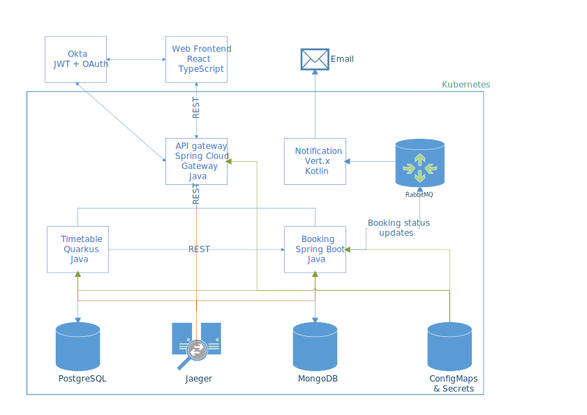

# Funktionale Anforderungen

Im Rahmen der Projektarbeit wird das Nachtzugbuchungssystem aus der zweiten und fünften Übung erweitert.
Die Anwendung soll es grundsätzlich ermöglichen Nachtzugverbindungen zwischen zwei Destinationen anzuzeigen und für diese auch Tickets "buchen" zu können. Darüber hinaus wird ein "Entdeckungsmodus" angeboten, mit dem für einen Abfahrtsbahnhof alle Ziele angezeigt werden und entsprechende Tickets gebucht werden können.
Der Benutzer eines Tickets wird mittels E-Mail-Benachrichtigungen über den Status seiner Buchung (reserviert, bestätigt oder abgelehnt) auf dem Laufenden gehalten.

# Architektur

## System

Das Diagramm unten zeigt die Architektur des Systems.
Die Services für das Suchen von Verbindungen zwischen Bahnhöfen (Timetable-Service), für das Buchen von Tickets (Booking-Service), das API-Gateway, welches Clients einen einheitlichen Endpunkt bietet und an das Booking-Service sowie das Timetable-Service delegiert, sowie das Notification-Service werden dabei einem Kubernetes-Cluster betrieben, wobei Minikube als Kubernetes-Distribution verwendet wird.

Das Timetable- und das Booking-Service stellen dabei jeweils eine REST-Schnittstelle zur Verfügung und eine entsprechende Dokumentation mittels OpenAPI zur Verfügung.
Das API-Gateway vereinheitlicht den Zugriff auf die beiden REST-Schnittstellen und stellt ebenfalls eine OpenAPI-Dokumentation bereit, welche aus den beiden OpenAPI-Dokumentationen der Timetable- und Booking-Services automatisch zusammengestellt wird.
Das Booking-Service publisht zusätzlich Buchungen, deren Status (reserviert, bestätigt oder abgelehnt) sich ändert, an eine entsprechende AMQP-Queue.
Der Notification-Service tritt als entsprechender Subscriber ein und erstellt bei Empfang einer Nachricht eine entsprechende E-Mail und sendet diese an den Benutzer, der mit der Buchung assoziiert ist.

Darüber hinaus werden noch die benötigten Infrastruktur-Komponenten, nämlich die PostgreSQL-Datenbank, die Mongo-Datebank, der RabbitMQ-Server und der Jaeger-Server in Kubernetes betrieben.
Sowohl das API-Gateway, der Timetable-Service und der Booking-Service sind mit entsprechenden Tracern implementiert, über welche Aufrufe nachverfolgt werden und an den Jaeger-Service reportet werden können.

Das Booking-Service, das Timetable-Service und das API-Gateway sollen ihre Konfiguration aus Kubernetes-ConfigMaps und -Secrets beziehen.

Die Authentifizierung erfolgt über OAuth und daher über JWTs.
Als Authentifizierungs-Provider wird – auf Anraten von Prof. Heinzelreiter – Okta verwendet.
Im Backend überprüfen sowohl API-Gateway und Booking-Service die JWTs beim Zugriff auf Ressourcen zur Buchung von Tickets.
Das API-Gateway leitet die JWTs an das Booking-Service weiter.

Das Web-Frontend ist mit React und TypeScript realisiert und bietet eine graphische Möglichkeit Verbindungen zu suchen sowie Tickets zu buchen.

## Ablauf der Kommunikation

Lukas

## Domänenmodell

Lukas

### Timetable-Service

Lukas

### Booking-Service

Lukas

# API-Gateway

Lukas

## OpenAPI

Lukas

# Kubernetes

Lukas

## Infrastruktur-Services

Lukas

# Frontend

Daniel

# Authentifizierung

## API-Gateway und Services

Lukas

## Frontend

Daniel
